# Bank Console Application
## Branch Setup:
* main branch is for final product.
* cooking_lab branch Used for development and testing purposes.
## Project Screenshots:
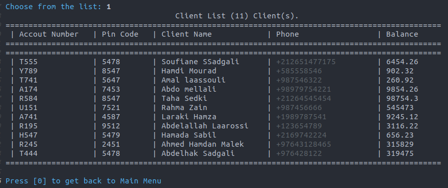
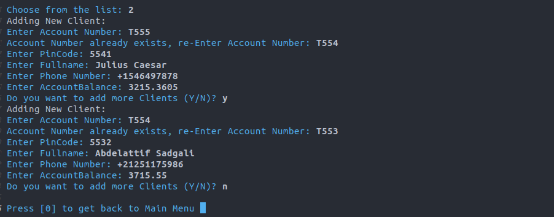
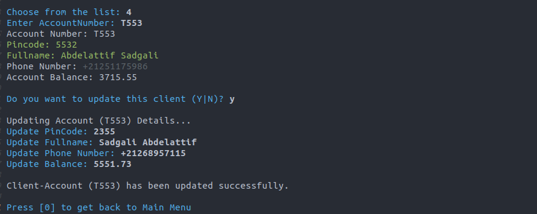
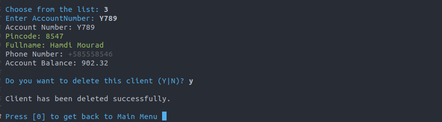
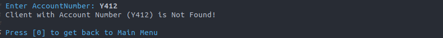
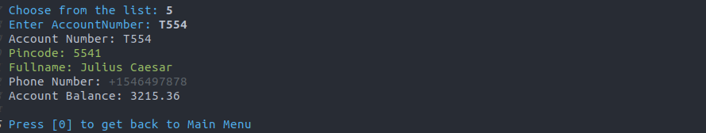
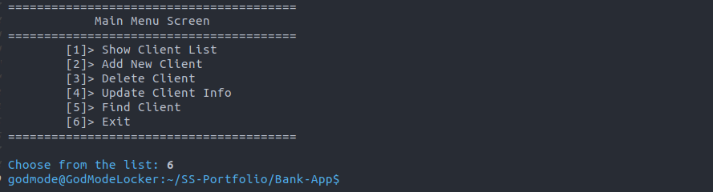
## Extension (1): Transaction Ops
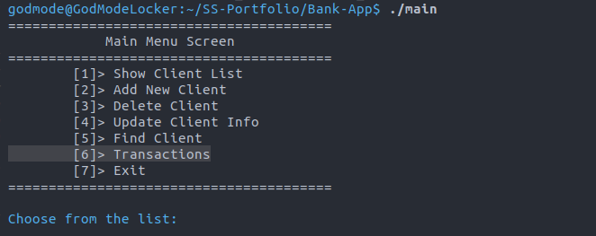
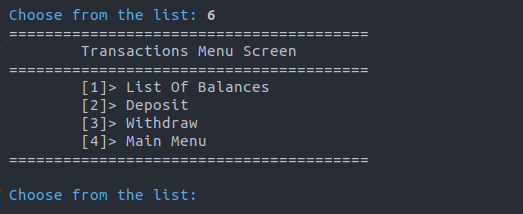
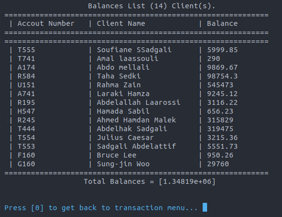
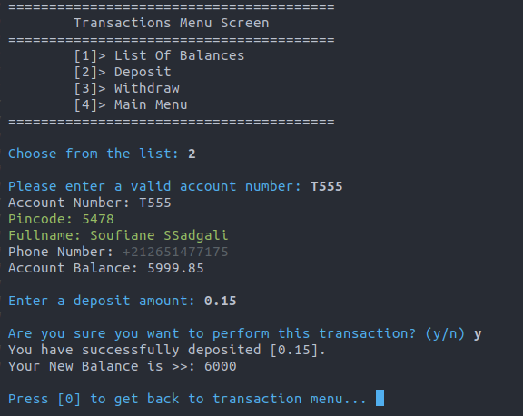
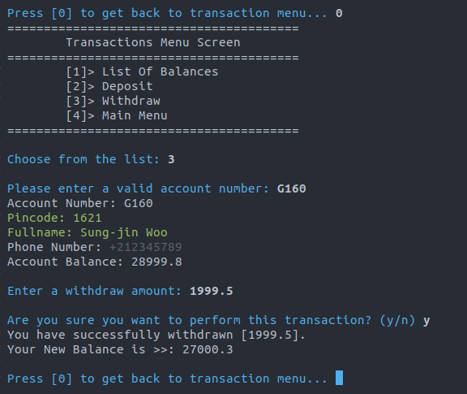
